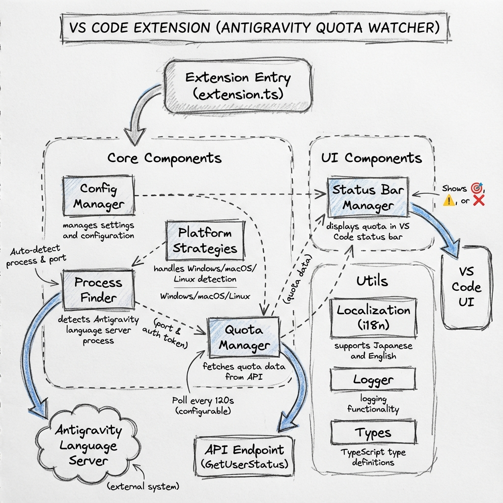

# Antigravity Quota (AGQ)

[English Version (README.md)](./README.md)

Antigravity AI モデルの利用クォータ（制限）をリアルタイムで監視し、VS Code のステータスバーに表示する軽量な拡張機能です。


## インストール方法

### GitHub から（推奨）

1. [Releases](https://github.com/kkitase/AntigravityQuota/releases/latest) から最新の `.vsix` ファイルをダウンロードします。
2. VS Code を開き、`拡張機能` ビュー（`Ctrl+Shift+X`）の右上にある `...` ボタンから `VSIX からインストール...` を選択します。
3. VS Code または Antigravity を再起動してください。

### 拡張機能ビューから

1. VS Code の拡張機能ビューを開きます。
2. "Antigravity Quota (AGQ)" で検索します。
3. `インストール` をクリックしてください。

## 主な機能

### リアルタイム クォータ監視

- **自動検出** – Antigravity の言語サーバー プロセス、ポート、認証トークンを自動的に検出します。手動設定は不要です。
- **バックグラウンド ポーリング** – 定期的にクォータ情報を取得し、ステータスバーを常に最新の状態に保ちます。
- **マルチモデル対応** – Gemini、Claude、GPT など、利用可能なすべての AI モデルのクォータを追跡します。

### ステータスバーへの統合

- クォータ情報をステータスバーに直接表示します。
- **視覚的なインジケーター**:
    - `$(check)` – 十分な残り（20% 以上）
    - `$(warning)` – 残りわずか（20% 未満）
    - `$(error)` – クォータ切れ
- クリックすると詳細なクォータ メニューが開きます。

### ピン留め機能

- お気に入りのモデルをステータスバーにピン留めして、いつでも確認できるようにします。
- メニューから簡単にピン留めの切り替えが可能です。
- ピン留めがない場合は、デフォルトで "AGQ" と表示されます。

### インタラクティブ メニュー

- プログレスバーとパーセンテージで、全モデルの状況を一目で把握できます。
- モデルごとのリセットまでの時間を確認できます。
- プロンプト クレジット（利用可能量 / 月間上限）の表示に対応しています。

### マルチ プラットフォーム対応

- **Windows** – `wmic` を使用したプロセス検出に対応。
- **macOS / Linux** – Unix ベースの検出ロジックにより動作します。

## コマンド

| コマンド | 説明 |
| ------------------ | --------------------------- |
| `AGQ: Refresh Now` | クォータ情報を手動で更新します。 |

## 設定

VS Code の設定（`Ctrl+,`）から **AGQ** を検索してカスタマイズできます。

| 設定項目 | デフォルト | 説明 |
| --------------------- | ------- | ------------------------------------------- |
| `agq.enabled`         | `true`  | クォータ監視の有効 / 無効を切り替えます。 |
| `agq.pollingInterval` | `120`   | 更新の間隔（秒）。最小 30 秒です。 |
| `agq.pinnedModels`    | `[]`    | ステータスバーに表示するモデル ID の一覧。 |

## 開発者向け

### ソースコードからのビルド

```bash
# 依存関係のインストール
npm install

# TypeScript のコンパイル
npm run compile

# VSIX パッケージの作成
npm run node:vsix:package
```

Bun をお使いの場合:

```bash
bun run bun:vsix:package
```

## アーキテクチャ

Antigravity Quota は、以下のコンポーネントが連携して動作します。



## 仕組み

1. **プロセス検出 (`ProcessFinder`)** – 実行中の `Antigravity` 言語サーバープロセスをスキャンし、接続に必要なポート番号と CSRF トークンを自動的に抽出します。
2. **ポート検出** – 抽出されたポートに対して接続テストを行い、正しい API エンドポイントを特定します。
3. **データ取得 (`QuotaManager`)** – 特定したエンドポイントの `GetUserStatus` API を定期的に呼び出し、モデルごとの残りクォータやプロンプトクレジットを取得します。
4. **UI 更新 (`StatusBarManager`)** – 取得したデータを解析し、VS Code のステータスバーをリアルタイムで更新します。

## 免責事項

本プロジェクトは Google によって承認されたものではなく、Google または Antigravity の公式な見解を反映するものではありません。
一部のコードは [Antigravity Quota Watcher](https://github.com/wusimpl/AntigravityQuotaWatcher) プロジェクトに基づいています。

## ライセンス

[MIT License](LICENSE)
